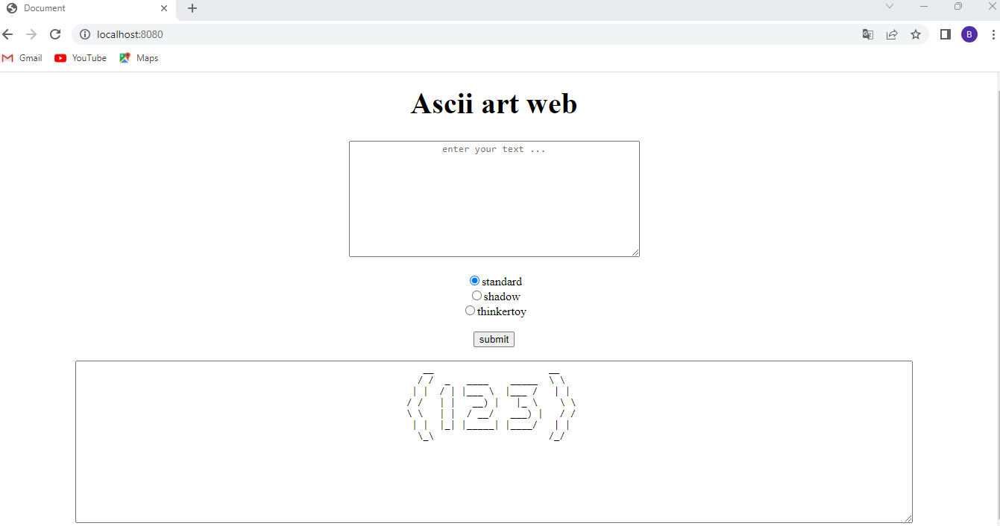

#ASCII ART WEB

Le projet ASCII ART WEB est l un des optionel du projet ASCII ART simple qui consiste a creer faire fonctionner un serveur web en golang, dans lequel il sera possible d utiliser une version d interface d utilisateur graphique web du projet ASCIi ART simpe en gerant les erreurs.

Nous allons besoin des bannieres suivantes :

.standard
.shadow
.thinkertoy

Pour creer notre serveur web, nous allons utiliser une fonction HandleFunc(). La fonction HandleFunc() est une fonction du package net/http en Go (Golang) qui permet de définir des gestionnaires de requêtes HTTP pour un serveur. Elle est utilisée pour associer une fonction de rappel (handler) à un chemin d'URL spécifique.

.Le premier argument pattern est une chaîne de caractères qui spécifie le motif du chemin d'URL auquel le gestionnaire doit répondre. Par exemple, "/users" pour correspondre à l'URL "http://monserveur.com/users".

.Le deuxième argument handler est une fonction de rappel qui sera exécutée lorsque le serveur reçoit une requête correspondant au motif du chemin d'URL. Cette fonction doit prendre deux paramètres : http.ResponseWriter pour écrire la réponse HTTP et *http.Request pour représenter la requête HTTP entrante.

.Vos points d'accès doivent renvoyer les codes d'état HTTP appropriés.

-> OK (200), si tout s'est déroulé sans erreur.
-> Non trouvé, si rien n'est trouvé, par exemple des modèles ou des bannières.
-> Bad Request (mauvaise demande), pour les demandes incorrectes.
-> Internal Server Error, pour les erreurs non gérées.

